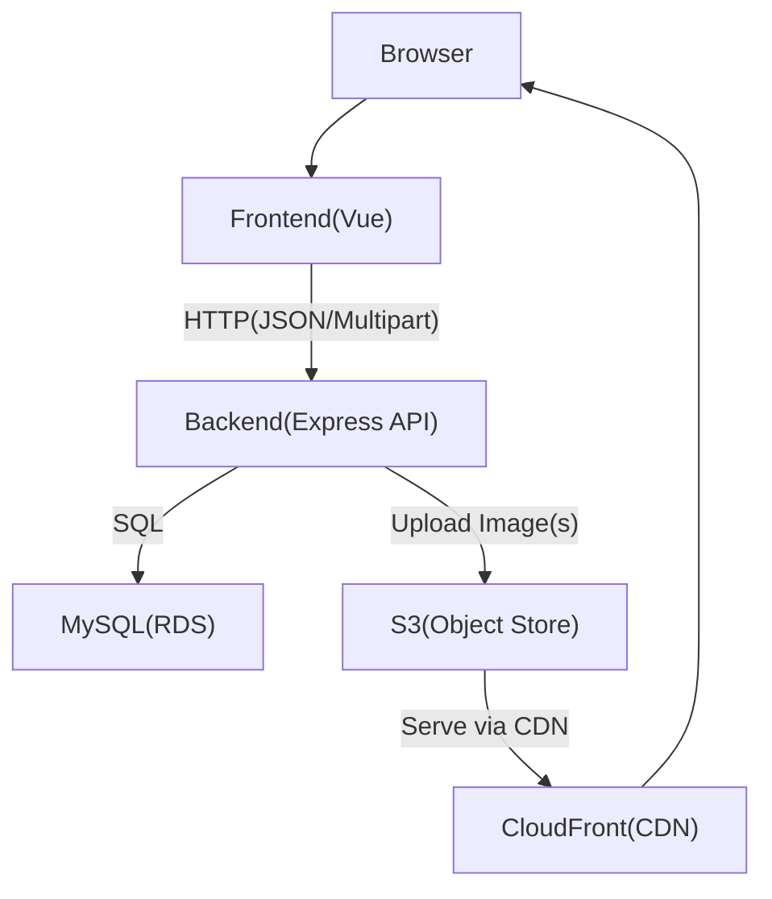
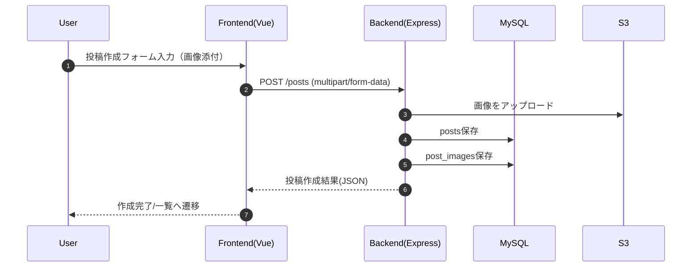

# アーキ設計書（掲示板アプリ）

## 1. 全体概要

本アプリは掲示板アプリケーションであり、主に以下の機能を提供します。

- 投稿一覧
  - 1ページあたり10件
  - 11件目以降はページングで表示
  - 投稿者名、投稿内容、投稿日時を表示
  - 各投稿の最下部に削除ボタン（押下で当該投稿を削除）
- 投稿作成・修正
  - 投稿者名と投稿内容を入力
  - 投稿内容に画像を含めることが可能
  - 修正は投稿者以外も可能

システムは要件の通り、フロント/バック/DB/画像配信を分離せずに「1台構成」かつ「コスト重視」で構築します。

## 2. 技術スタックと前提

| 分類 | 技術 | ホスト先 | 備考 |
| --- | --- | --- | --- |
| フロントエンド | Vue.js | EC2 | フロントバック同サーバ |
| バックエンド | Express | EC2 | REST API 提供 |
| DB | MySQL | RDS | private subnet |
| 画像 | S3 + CloudFront | AWS | CloudFrontを前段に挟む |
| テスト | Jest | - | バックエンドのUTのみ |
| インフラ構築 | Terraform | AWS | |
| CICD | GitHub Actions | - | mainプッシュでテスト・ビルド→デプロイ |

前提:
- サーバは1台構成（EC2）
- EC2はpublic subnet、RDSはprivate subnet
- EC2は手動ではSSMでのみアクセス可能
- mainブランチへのプッシュで以下を実施
  - テストとビルド（CI）
  - デプロイ（CD）

### 2.1 フロントエンド（Vue 3 + Vite + TypeScript）構成（ひな型）

フロントエンドは `frontend/` 配下に実装し、Vue 3 + Vite + TypeScript で構成します。

- エントリポイント: `frontend/src/main.ts`
  - Vueアプリの生成・マウント、`vue-router` の有効化
- ルーティング: `frontend/src/router/index.ts`
  - `/` → 投稿一覧
  - `/posts/new` → 投稿作成
  - `/posts/:id/edit` → 投稿修正
- ページ（画面骨格）:
  - `frontend/src/pages/PostsList.vue`（投稿一覧 + ページング + 削除ボタン）
  - `frontend/src/pages/PostCreate.vue`（投稿作成フォーム + 画像multipart添付）
  - `frontend/src/pages/PostEdit.vue`（投稿修正フォーム + 画像multipart添付）
- APIクライアント（プレースホルダ）: `frontend/src/api/posts.ts`
  - `getPosts(page)`
  - `createPost(formData)`（multipartを想定）
  - `updatePost(id, formData)`（multipartを想定）
  - バックエンド接続先は `VITE_API_BASE_URL`（未確定値）に寄せる方針

### 2.2 画像アップロード方針（フロント）

- 投稿作成/修正フォームから画像を `multipart/form-data` として送信します。
- 画像のフォームフィールド名は、バックエンド実装に合わせて調整可能な前提です（ひな型では `images[]` を使用）。

## 3. コンポーネント設計（アーキ図）

## 4. データフロー

### 4.1 投稿一覧取得
- ブラウザがページ番号を指定して一覧取得APIを呼び出す
- バックエンドがDBから該当ページ分を取得し、フロントへJSONで返す
- フロントは一覧を表示する（10件/ページ）

### 4.2 投稿作成（画像を含む）
- ブラウザが投稿内容と画像（multipart）を送信
- バックエンドが画像をS3へアップロード
- バックエンドがDBへ
  - 投稿本体（posts）
  - 画像紐付け（post_images）
  を保存
- 保存結果（新規投稿ID等）を返す

### 4.3 投稿削除
- フロントが削除ボタン押下により削除APIを呼び出す
- バックエンドがDB上の投稿および紐付く画像情報を削除
- 画像本体の削除方針（S3のオブジェクトも削除するか、保持するか）は後述の未確定事項に従う

## 5. API設計（主要エンドポイント）

認証・認可の方式は未確定ですが、現ドラフトでは「機能として必要なCRUD」が中心です。

### 5.1 投稿一覧
- `GET /api/posts?page=1`
- 動作:
  - 1ページ10件
  - pageは整数（1始まりを想定）
  - DBから `ORDER BY created_at DESC` 等で取得し、該当件を返す
- 返却例（JSON）:
  - `posts`: 投稿配列
  - `page`: 現在ページ
  - `hasNext`: 次ページ有無

### 5.2 投稿単体取得
- `GET /api/posts/:id`
- 動作:
  - 指定IDの投稿と紐づく `post_images` を返す
  - 存在しない場合は 404
- 返却: 投稿オブジェクト（`images` 配列を含む）

### 5.3 投稿作成（画像あり）
- `POST /api/posts`
- Body:
  - `author`: 投稿者名
  - `content`: 投稿内容（テキスト）
  - `images[]`: 画像（multipart/form-data）
 - 動作:
  - 受領した画像をS3へアップロード
  - 投稿を `posts` に保存
  - 画像のメタ情報を `post_images` に保存
 - 返却:
  - 作成した投稿情報（または投稿ID）

### 5.4 投稿修正
- `PUT /api/posts/:id`
- Body:
  - `author`（任意: 更新するか方針を後述）
  - `content`
  - （画像更新が必要なら）`images[]` / 画像差分の扱い方は未確定事項
- 動作:
  - 指定IDの投稿を更新
  - 画像更新がある場合はS3と `post_images` を整合させる
- 仕様:
  - 「投稿者以外も修正可能」という要件を反映（認可制御は後述）

### 5.5 投稿削除
- `DELETE /api/posts/:id`
- 動作:
  - 対象投稿をDBから削除
  - `post_images` も削除
  - ストレージ上の画像はベストエフォートで削除

### 5.6 投稿いいね
- `POST /api/posts/:id/likes`
- Body: なし
- 動作:
  - 指定IDの投稿が存在することを確認
  - `post_likes` に1行 INSERT（同一人物の制限なし）
- 返却: `201` `{ "like_count": number }`
- 一覧・詳細の `PostDto` に `like_count` を含める（`GET /api/posts`, `GET /api/posts/:id`）

## 6. DB設計（テーブル案）

### 6.1 `posts`（投稿本体）
- `id`（PK）
- `author`（投稿者名）
- `content`（投稿内容）
- `created_at`
- `updated_at`

### 6.2 `post_images`（投稿画像紐付け）
- `id`（PK）
- `post_id`（FK -> posts.id）
- `s3_key`（S3上のキー）
- `image_url`（後述の方針により保持: CloudFrontのURL直書き or クライアント生成）
- `sort_order`（表示順を安定させるため）

### 6.3 `post_likes`（投稿いいね）
- `id`（PK）
- `post_id`（FK -> posts.id, ON DELETE CASCADE）
- `created_at`

一覧ページング用途のため、少なくとも以下のインデックスを想定:
- `posts(created_at)`
- `post_images(post_id)`
- `post_likes(post_id)`

## 7. 非機能と運用方針（ベース）

### 7.1 コスト重視の方針
- EC2 1台構成（フロントバック同サーバ）
- RDSはprivate subnetへ配置（直接公開しない）
- 画像はS3に集約し、配信はCloudFrontでコスト最適化

### 7.2 テスト方針
- JestでバックエンドのUTのみ実施
- APIの基本ケース（一覧/作成/更新/削除）を最低限カバー

### 7.3 CI/CD方針
- GitHub Actions
  - mainプッシュ時に
    - バックエンドUT
    - フロント・バックのビルド
  - デプロイでは
    - EC2へ成果物反映
    - 必要に応じてDBマイグレーションを実行

## 8. 未確定事項（要決定）

現ドラフト時点では以下を「次の手順で確定」扱いにします。

- 認証・権限
  - 投稿削除/修正を誰が実行できるか
  - 投稿者以外の修正が許可される一方、削除も同様に許可するか
- 画像の保存/更新方式
  - `POST /api/posts`でmultipart送信し、バックエンドがS3へ保存する前提
  - 修正時の画像更新方針（全置換/差分/削除指定の有無）
  - S3オブジェクト削除の可否（DBから削除するだけか、S3も削除するか）
- 文字コード・サイズ上限
  - 例: 画像サイズ上限、投稿テキスト上限など

