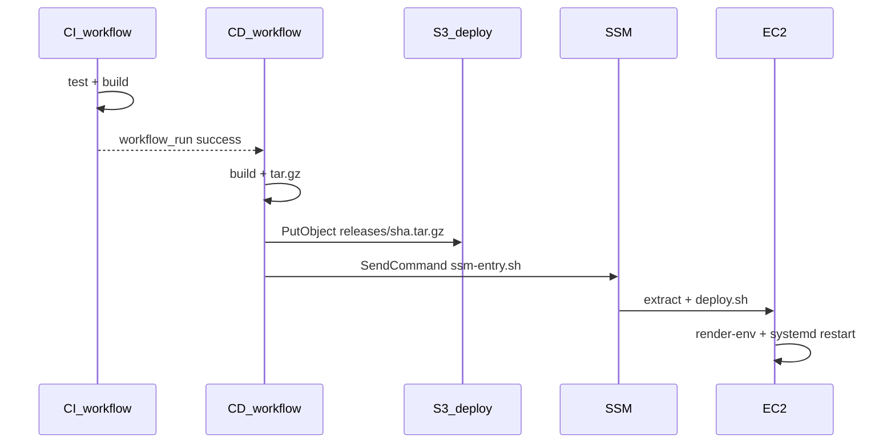

# デプロイ設計書（手順12: CI/CD 自動デプロイ）

本ドキュメントは [アーキ設計書](./architecture.md)・[インフラ設計書](./infra_design.md)・[要件ドラフト](../prompt/1_design_draft.md) の手順12に基づく。

## 1. 概要

`main` ブランチへのマージ後、GitHub Actions が CI（テスト・ビルド）成功を受けて CD を実行し、EC2 へアプリを反映する。

| 段階 | 手段 |
| --- | --- |
| 認証 | GitHub OIDC → IAM ロール（長期キーなし） |
| 成果物 | S3 デプロイバケット（`releases/<sha>.tar.gz`） |
| 反映 | SSM Run Command（SSH 不使用） |
| 公開 | nginx:80（静的 + `/api` プロキシ） |

**スコープ外（別手順）**: HTTPS/ACM、Terraform の `main` 自動 apply。

## 2. EC2 ディレクトリ構成

```
/opt/bbs-app/
  .env                 # render-env.sh が生成（600, owner bbs）
  .bootstrap_done      # 初回 bootstrap 完了マーカー
  current -> releases/<sha>/
  releases/<sha>/
    backend/dist, package.json, package-lock.json
    frontend/dist
    db/schema/
  scripts/             # bootstrap 後に常駐コピー
```

## 3. 環境変数（本番 `.env`）

| 変数 | 設定元 |
| --- | --- |
| `PORT` | 固定 `3000`（nginx がプロキシ） |
| `IMAGE_STORAGE_MODE` | `s3` |
| `AWS_REGION` | GitHub Variable / terraform |
| `S3_BUCKET` | terraform output `s3_bucket_name` |
| `CLOUDFRONT_BASE_URL` | terraform output `cloudfront_url` |
| `MYSQL_*` | Secrets Manager（`db_secret_arn`） |
| `CORS_ORIGIN` | terraform output `app_url` |

フロントは `VITE_API_BASE_URL` 未設定（同一オリジン `/api`）。

## 4. デプロイフロー



### 初回（bootstrap）

`workflow_dispatch` で `bootstrap=true` を指定すると:

1. `bootstrap.sh` — Node 24、nginx、MariaDB クライアント（`mariadb105` / `mysql` CLI）、systemd/nginx 配置
2. `deploy.sh` — 成果物展開
3. `apply-schema.sh` — `db/schema/*.sql` を RDS に適用（`RUN_SCHEMA_APPLY=true`）

### 通常デプロイ

`main` マージ → CI 成功 → CD が S3 + SSM で `deploy.sh` のみ実行。

## 5. Terraform 追補（手動 apply）

[infra/terraform/modules/github_deploy](../infra/terraform/modules/github_deploy):

- GitHub OIDC プロバイダ + IAM ロール
- デプロイ用 S3 バケット（30 日で `releases/` 期限切れ）
- EC2 ロール: deploy バケット読取、DB シークレット読取

```bash
cd infra/terraform
terraform plan
terraform apply
```

## 6. GitHub 設定（Repository Variables）

Settings → Secrets and variables → Actions → **Variables**:

| 名前 | 取得元 |
| --- | --- |
| `AWS_ROLE_ARN` | `terraform output github_actions_role_arn` |
| `AWS_REGION` | `ap-northeast-1` |
| `EC2_INSTANCE_ID` | `terraform output ec2_instance_id` |
| `DEPLOY_BUCKET` | `terraform output deploy_bucket_name` |
| `DB_SECRET_ARN` | `terraform output db_secret_arn` |
| `S3_BUCKET` | `terraform output s3_bucket_name` |
| `CLOUDFRONT_BASE_URL` | `terraform output cloudfront_url` |
| `CORS_ORIGIN` | `terraform output app_url` |

## 7. 検証チェックリスト

- [ ] `terraform apply` 後、上記 Variables を設定
- [ ] Actions → CD → **Run workflow**（`bootstrap=true`）が成功
- [ ] `curl http://<app_url>/api/health` が 200
- [ ] ブラウザで投稿一覧・作成・画像（CloudFront）が動作
- [ ] `main` マージ後、CI → CD が連鎖実行される

## 8. 未確定事項

- HTTPS（443）は SG のみ開放。nginx SSL / ACM は別手順
- ロールバック手順の自動化（手動で `current` シンボリックリンク切替は可能）
