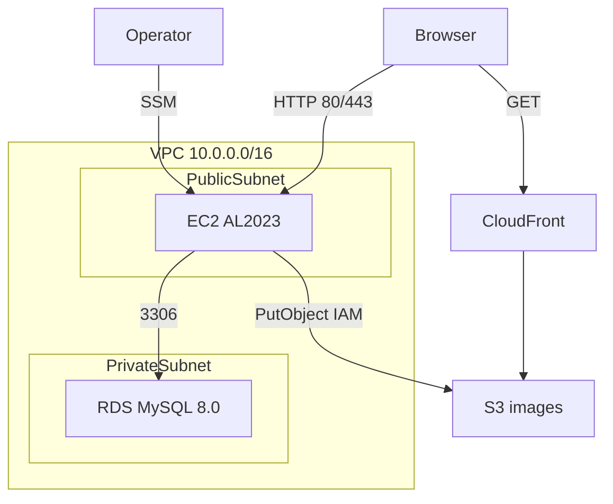

# インフラ設計書（手順11: Terraform）

本ドキュメントは [アーキ設計書](./architecture.md) と [要件ドラフト](../prompt/1_design_draft.md) の手順11に基づき、AWS 基盤の構成を定義する。

## 1. 概要

掲示板アプリ向けに、コスト重視・1台構成で以下を Terraform で構築する。

| コンポーネント | 配置 | 備考 |
| --- | --- | --- |
| EC2 | public subnet | Vue + Express 同居（ランタイム設定は手順12） |
| RDS MySQL | private subnet | EC2 からのみ 3306 |
| S3 + CloudFront | リージョン / グローバル | 画像保存・配信（OAC） |
| 管理接続 | SSM Session Manager | SSH（22）は開放しない |

**手順11のスコープ外**: GitHub Actions デプロイ、nginx/systemd、DDL 自動実行、`main` への自動 `terraform apply`。

## 2. 構成図

## 3. ネットワーク

| 項目 | 値 |
| --- | --- |
| VPC CIDR | `10.0.0.0/16` |
| AZ | EC2 は 1 AZ（public）。RDS 用 DB subnet group は AWS 要件で **2 AZ** の private subnet（RDS 本体は Single-AZ） |
| Public subnet | EC2（`map_public_ip_on_launch`、IGW 経由で外向き） |
| Private subnet | RDS 用（2 AZ に 1 つずつ。2 つ目は RDS サブネットグループ要件のみ） |
| NAT Gateway | **なし**（コスト削減） |

## 4. セキュリティグループ

### 4.1 `sg_ec2`

| 方向 | プロトコル | ポート | ソース/宛先 |
| --- | --- | --- | --- |
| Inbound | TCP | 80, 443 | `0.0.0.0/0` |
| Outbound | ALL | ALL | `0.0.0.0/0` |

- **SSH (22) は開放しない**
- 将来 ALB を挟む場合は inbound を ALB SG に限定可能

### 4.2 `sg_rds`

| 方向 | プロトコル | ポート | ソース |
| --- | --- | --- | --- |
| Inbound | TCP | 3306 | `sg_ec2` のみ |

## 5. コンポーネント仕様

### 5.1 EC2

| 項目 | デフォルト |
| --- | --- |
| AMI | Amazon Linux 2023 |
| インスタンスタイプ | `t3.micro` |
| ルートボリューム | 30GB gp3（AL2023 AMI の最小要件） |
| IAM | `AmazonSSMManagedInstanceCore` + S3 Put/Delete（画像バケットのみ） |
| user_data | SSM エージェント有効化程度（Node/nginx は手順12） |

### 5.2 RDS

| 項目 | デフォルト |
| --- | --- |
| エンジン | MySQL 8.0 |
| インスタンス | `db.t4g.micro` |
| Multi-AZ | 無効 |
| DB 名 | `bbs` |
| マスターユーザー | `bbs_app`（アプリ接続と共用） |
| 認証情報 | Secrets Manager（`random_password` 生成） |
| 暗号化 | 有効 |

DDL（`db/schema/*.sql`）は Terraform では実行しない。手順12または SSM 経由で適用する。

### 5.3 S3 + CloudFront

| 項目 | 内容 |
| --- | --- |
| S3 | ブロックパブリックアクセス、バージョニング無効（コスト優先） |
| 読み取り | CloudFront OAC のみ |
| 書き込み | EC2 インスタンスプロファイル（`s3:PutObject` / `s3:DeleteObject`） |

キー形式は [s3Storage.ts](../backend/src/services/imageStorage/s3Storage.ts) に合わせ `posts/{postId}/...` とする。

## 6. コスト方針

- EC2 は 1 AZ、NAT Gateway なし
- RDS 用に 2 AZ の private subnet を持つが、2 つ目の subnet は DB subnet group 要件のみ（追加コストはほぼなし）
- RDS / EC2 は検証後 `terraform destroy` で停止可能
- 常時起動コストが発生する点に注意

## 7. アプリ環境変数との対応（本番）

[backend/.env.example](../backend/.env.example) および [env.ts](../backend/src/config/env.ts) との対応。

| アプリ変数 | 本番での設定元 |
| --- | --- |
| `IMAGE_STORAGE_MODE` | `s3` |
| `AWS_REGION` | `ap-northeast-1`（変数 `aws_region`） |
| `S3_BUCKET` | Terraform output `s3_bucket_name` |
| `CLOUDFRONT_BASE_URL` | output `cloudfront_url`（末尾スラッシュなし） |
| `MYSQL_HOST` | output `rds_endpoint` |
| `MYSQL_PORT` | `3306` |
| `MYSQL_DATABASE` | `bbs` |
| `MYSQL_USER` / `MYSQL_PASSWORD` | Secrets Manager（output `db_secret_arn`） |
| `CORS_ORIGIN` | output `app_url` |
| `VITE_API_BASE_URL` | 空（nginx で同一オリジン `/api` プロキシ時） |

## 8. Terraform State

- **初回**: local state（`infra/terraform/terraform.tfstate` はコミットしない）
- チーム運用時は S3 + DynamoDB ロックへの移行を推奨（手順は [infra/terraform/README.md](../infra/terraform/README.md)）

## 9. 手順12への引き継ぎ

1. `terraform output` で `app_url`, `cloudfront_url`, `s3_bucket_name`, `rds_endpoint`, `db_secret_arn` を取得
2. EC2 に Node 24、systemd（backend）、nginx（`frontend/dist` + `/api` プロキシ）を配置
3. Secrets Manager から DB 認証情報を `.env` に反映
4. `db/schema/*.sql` を RDS に適用
5. GitHub Actions OIDC + デプロイ workflow — [docs/deploy_design.md](./deploy_design.md) を参照

## 10. 未確定事項

- カスタムドメイン / ACM 証明書（HTTPS 終端を ALB または EC2 nginx で行うか）
- Terraform State の S3 backend 移行タイミング
- RDS の `skip_final_snapshot`（本番では `false` 推奨）
