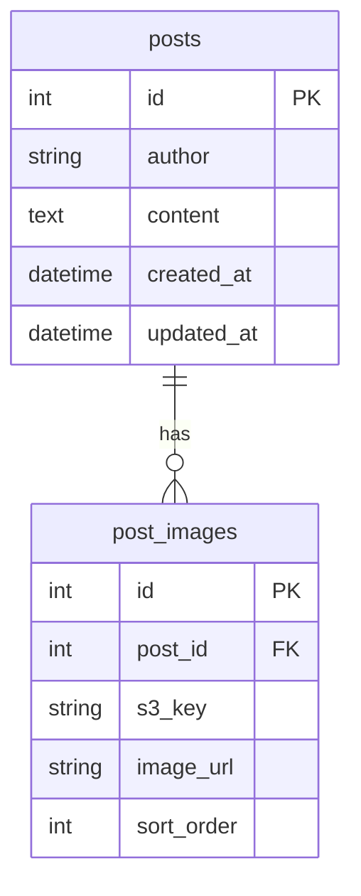

# テーブル設計書（掲示板アプリ）

このドキュメントは、[アーキ設計書](./architecture.md)と[要件ドラフト](../prompt/1_design_draft.md)に基づき、DB実装に向けたテーブル設計をまとめたものです（DDL案まで踏み込みません）。

## 1. 前提/スコープ

- 認証: ドラフト上で明記がないため、設計上は前提しない（認証方式は次工程で確定）。
- 投稿者: `posts.author` に文字列として保持する。
- 画像:
  - 投稿本文に画像を含める要件があるため、画像自体はS3に格納し、DBにはS3上の識別情報（`post_images.s3_key`）を保持する。
  - 表示用の`image_url`の保持方式は未確定（後述）。

## 2. ER図（Mermaid）

## 3. テーブル仕様

### 3.1 `posts`（投稿本体）

#### 意図
- 投稿の本体データを保持する
- 投稿一覧のページング（10件/ページ、作成日時の新しい順）に利用する

#### カラム（案）
- `id`（PK）
  - 投稿を一意に識別する整数（auto increment想定）
- `author`
  - 投稿者名（文字列）
- `content`
  - 投稿内容（テキスト）
- `created_at`
  - 作成日時
- `updated_at`
  - 更新日時

#### 制約/整合性（ベース）
- `id`は一意制約
- `author`/`content`は少なくともNOT NULL想定（詳細は次工程で確定）

#### インデックス（例）
- `posts(created_at)`
  - `ORDER BY created_at DESC` を使う一覧取得の効率化

### 3.2 `post_images`（投稿画像紐付け）

#### 意図
- 1投稿に対して複数画像を紐づけるための中間テーブル
- 画像の順序を保持し、一覧/詳細表示で安定した表示順を実現する

#### カラム（案）
- `id`（PK）
  - 画像レコードを一意に識別する整数（auto increment想定）
- `post_id`（FK -> `posts.id`）
  - 親投稿への参照
- `s3_key`
  - S3上のキー（画像本体識別）
- `image_url`
  - 表示用URLの保持方針は未確定
  - 例:
    - CloudFrontのURL直書き（DBにフルURLを保持）
    - クライアント側/サーバ側で `s3_key` から組み立てる（DBにはキーのみ保持してURL組み立て）
- `sort_order`
  - 投稿内での画像順序

#### 制約/整合性（ベース）
- `post_id`は `posts.id` を参照する外部キー
- 削除時の挙動（カスケード削除等）は、S3削除方針とセットで後述の未確定事項として扱う

#### インデックス（例）
- `post_images(post_id)`
  - 投稿IDで画像を引く処理の効率化

## 4. アプリ要件との対応

- 投稿一覧
  - `posts.created_at` を基に並び順を作り、ページングに使う
  - 一覧取得時に `post_images` を必要に応じてまとめて取得（N+1回避は次工程で方針化）
- 投稿作成/修正
  - 投稿作成時: `posts` と `post_images` を同時に保存
  - 投稿修正時: 画像更新方針（全置換/差分/削除指定）に応じて更新手順を決める
- 投稿削除
  - `posts` を削除する際に、紐づく `post_images` も整合するように削除する
  - S3側オブジェクトの扱いは未確定事項

## 5. 未確定事項（次工程で確定させる）

- 画像の `image_url` の保持方式
  - DBに `image_url`（フルURL）を保持するか
  - それとも `s3_key` のみ保持して、サーバ/フロントで組み立てるか
- S3オブジェクト削除の扱い
  - DB削除（post_images/posts削除）に合わせてS3も削除するか
  - あるいは保持する（コストや監査要件による）か
- 修正時の画像更新方針
  - 全置換（既存画像を削除→新規追加）か
  - 差分更新（追加/削除/並び替え）か
- 文字コード・サイズ上限
  - 投稿テキスト長、画像サイズ上限、拡張子制限など（実装時に確定）

