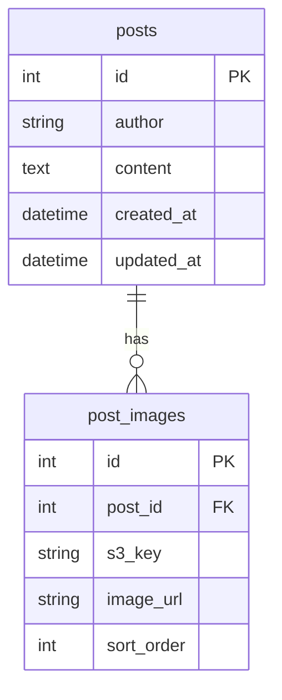

# テーブル設計書（掲示板アプリ）

このドキュメントは、[アーキ設計書](./architecture.md)と[要件ドラフト](../prompt/1_design_draft.md)に基づき、DBのテーブル設計をまとめたものです。DDL/DML の実装は [`db/`](../db/) 配下にあります。

## 1. 前提/スコープ

- 認証: ドラフト上で明記がないため、設計上は前提しない（認証方式は次工程で確定）。
- 投稿者: `posts.author` に文字列として保持する。
- 画像:
  - 投稿本文に画像を含める要件があるため、画像自体はS3に格納し、DBにはS3上の識別情報（`post_images.s3_key`）を保持する。
  - 表示用の`image_url`の保持方式は未確定（後述）。

## 2. ER図（Mermaid）

## 3. テーブル仕様

### 3.1 `posts`（投稿本体）

#### 意図
- 投稿の本体データを保持する
- 投稿一覧のページング（10件/ページ、作成日時の新しい順）に利用する

#### カラム（確定）
- `id`（PK）: `BIGINT UNSIGNED` AUTO_INCREMENT
- `author`: `VARCHAR(100) NOT NULL` — 投稿者名
- `content`: `TEXT NOT NULL` — 投稿内容
- `created_at`: `DATETIME(3) NOT NULL DEFAULT CURRENT_TIMESTAMP(3)`
- `updated_at`: `DATETIME(3) NOT NULL DEFAULT CURRENT_TIMESTAMP(3) ON UPDATE CURRENT_TIMESTAMP(3)`

#### 制約/整合性（確定）
- `id` は主キー
- `author` / `content` は NOT NULL
- 文字コード: `utf8mb4` / `utf8mb4_unicode_ci`

#### インデックス（確定）
- `idx_posts_created_at (created_at)` — `ORDER BY created_at DESC` 用

### 3.2 `post_images`（投稿画像紐付け）

#### 意図
- 1投稿に対して複数画像を紐づけるための中間テーブル
- 画像の順序を保持し、一覧/詳細表示で安定した表示順を実現する

#### カラム（確定）
- `id`（PK）: `BIGINT UNSIGNED` AUTO_INCREMENT
- `post_id`（FK → `posts.id`）: `BIGINT UNSIGNED NOT NULL`
- `s3_key`: `VARCHAR(512) NOT NULL` — S3上のキー
- `image_url`: `VARCHAR(2048) NULL` — 表示用URL（保持方式は手順9で確定）
- `sort_order`: `INT UNSIGNED NOT NULL DEFAULT 0` — 投稿内の表示順

#### 制約/整合性（確定）
- `post_id` は `posts.id` を参照する外部キー
- 親投稿削除時: `ON DELETE CASCADE`（`post_images` 行も DB 上で削除）

#### インデックス（確定）
- `idx_post_images_post_id (post_id)`

## 4. SQL 資産

| ファイル | 内容 |
| --- | --- |
| [db/schema/001_create_database.sql](../db/schema/001_create_database.sql) | DB 作成・utf8mb4 |
| [db/schema/002_create_tables.sql](../db/schema/002_create_tables.sql) | テーブル DDL |
| [db/seeds/dev_seed.sql](../db/seeds/dev_seed.sql) | 開発用 DML（12投稿） |
| [db/README.md](../db/README.md) | ローカル適用手順 |

## 5. アプリ要件との対応

- 投稿一覧
  - `posts.created_at` を基に並び順を作り、ページングに使う
  - 一覧取得時に `post_id IN (...)` で `post_images` を一括取得（N+1回避）
- 投稿作成/修正
  - 投稿作成時: `posts` と `post_images` を同一トランザクションで保存
  - 投稿修正時: `images[]` が multipart で送られた場合のみ **全置換**（既存行削除→新規アップロード）
- 投稿削除
  - `posts` を削除する際に、紐づく `post_images` も DB 上は CASCADE で削除
  - ストレージ（ローカル/S3）のオブジェクトはベストエフォートで削除

## 6. 手順9で確定した事項

| 項目 | 方針 |
| --- | --- |
| `image_url` | `s3_key` を正とし、保存時に `CLOUDFRONT_BASE_URL` または `LOCAL_PUBLIC_BASE_URL` からフルURLを組み立てて `image_url` に保存。NULL の既存行は API 応答時に `buildPublicUrl(s3_key)` で補完 |
| ローカル開発の画像 | `IMAGE_STORAGE_MODE=local` で `uploads/` に保存し `/uploads` で配信 |
| 本番の画像 | `IMAGE_STORAGE_MODE=s3` + `S3_BUCKET` + `CLOUDFRONT_BASE_URL` |
| S3/ローカル削除 | DB 削除成功後にベストエフォート削除（失敗しても API は成功） |
| 修正時の画像 | `images[]` ファイルあり → 全置換。未送信 → `author`/`content` のみ更新 |
| バリデーション | `author` 最大100文字必須、`content` 必須、画像 `image/*`・5MB/枚・最大10枚/投稿 |
| 認証 | なし（削除・修正は誰でも可） |
